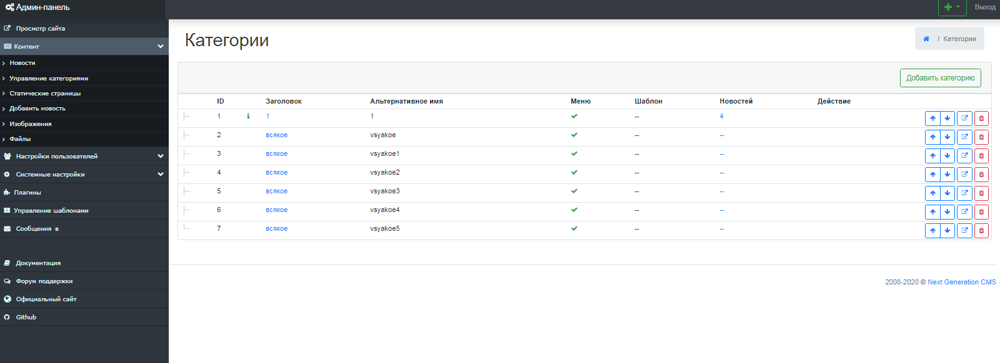

-   [Знакомство с системой]()
    -   [Основные сведения](about.html)
    -   [Вход в систему управления](enter.html)
    -   [Основные компоненты управления](components.html)
-   [Установка системы]()
    -   [Требования к хостингу](hosting.html)
    -   [Инсталляция](installation.html)
-   [Возможности NGCMS]()
    -   [Управление контентом]()
        -   [Новости](news.html)
        -   [Категории](catigories.html)
        -   [Статические страницы](static.html)
    -   [Настройки пользователей]()
        -   [Управление пользователями](users.html)
        -   [Блокировка IP-адресов](ipban.html)
    -   [Системные настройки]()
        -   [Настройки системы](config.html)
        -   [Управление базой данных](dbo.html)
        -   [Управление форматом ссылок](urls.html)
    -   [Дополнительные настройки]()
        -   [Управление плагинами](plugins.html)
        -   [Управление изображениями](images.html)
        -   [Управление файлами](files.html)
        -   [Управление шаблонами](templates.html)

Работа с категориями
====================

Сайты, созданные на базе Next Generation CMS, могут содержать произвольное количество разделов разной вложенности.
 Для удобного управления в CMS существует специальный инструмент, который позволяет создавать, редактировать категории, а также изменять порядок их отображения на сайте.

рис 4.1

Добавление новой категории
==========================

Для добавления новой категории, нажмите на вкладку "Добавить категорию" (рис 4.2).

рис 4.2

После этого вы будете перенаплавлены на страницу с формой, которую вам потребуется заполнить. (рис 4.3).

рис 4.3

**Внимание:** поле заголовок является обязательным к заполнению.

**Отображать категорию в меню** - Управляет видимостью раздела для построения навигации.
 Выключенные разделы в навигацию не попадают. В раздел, тем не менее, можно попасть, набрав его адрес в браузере.
 **Заголовок** - указывается название новой категории. Данные заголовка являются содержимым тега Title, которое показывается в заголовке окна браузера.
 Названием может быть любая комбинация букв, цифр и знаков препинания.
 **Режим отображения ссылок в меню категорий** - возможность выбора отображения каждой конкретной ссылки на категорию - всегда ссылка/ссылка если есть новости/всегда текст.
 **Альтернативное имя** - здесь необходимо указать ссылку на данную страницу-категорию. Если поле не заполнено, то URL будет сгенерирован по средствам транслитерации заголовка.
**Внимание:** ссылка должна указываться на латинице и не содержать спецсимволов и пробелов.
 **Описание** - используется при создании краткого описания категории.
 **Ключевые слова** - ключевые слова для метатега keyword.
 **Кол-во новостей на странице** - определение количества новостей для отображения на странице категории.
 **Шаблон для новостей категории** - выбор шаблонов, которые будут использоваться для данной категории.

**Для создания отдельного шаблона для конкретной категории:**
 1. Создать в каталоге вашего шаблона (предположим, что вы используете шаблон default) создать каталог ncustom - в нём будут храниться "персональные" шаблоны категорий: /templates/default/ncustom/ 2. Внутри только что созданного каталога - создаём каталоги для персональных шаблонов, например - custom1 и custom2. /templates/default/ncustom/custom1/ /templates/default/ncustom/custom2/ 3. В каталоге персонального шаблона необходимо создать следующие файлы: news.short.tpl - отвечает за вывод короткой новости news.full.tpl - отвечает за вывод полной новости comments.form.tpl - отвечает за вывод формы добавления комментария comments.show.tpl - отвечаеи за вывод комментариев

**Иконка** - URL к иконке новости (иконке категории родителя); если у категории-родителя нет иконки, то переменная будет пустой.
 Вывод осуществляется через переменную {icon} в шаблонах news.short.tpl и news.full.tpl
 **Альтернативный URL** - Параметр предназначен для добавления ссылок на внешние объекты (к примеру, на форум) внутри списка категорий.
**Внимание:** В категорию, для которой прописан альт. URL, добавлять новости нельзя!
 **Порядок сортировки внутри категории** - выбор в каком порядке будут сортироваться новости внутри каждой конкретной категории.
 **Категория-родитель** - вложенность внутри категории.

**Настройки плагинов**

-   запретить - по умолчанию комментарии в новостях этой категории запрещены
-   разрешить - по умолчанию комментарии в этой категории будут разрешены
-   по умолчанию - флаг разрешения/запрета комментариев будет браться из параметра "по умолчанию комментарии"

© 2008-2020 Next Generation CMS
