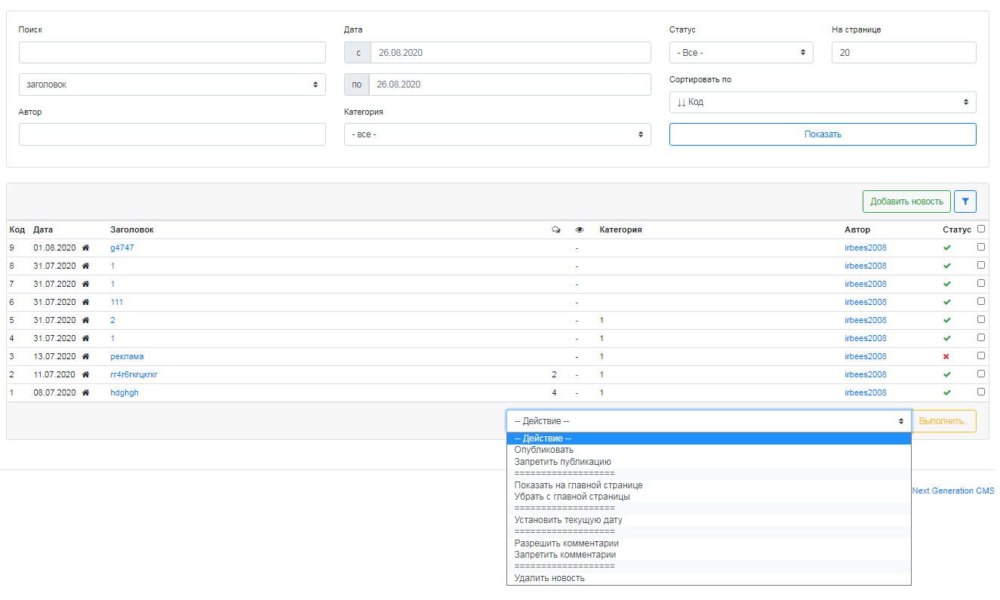
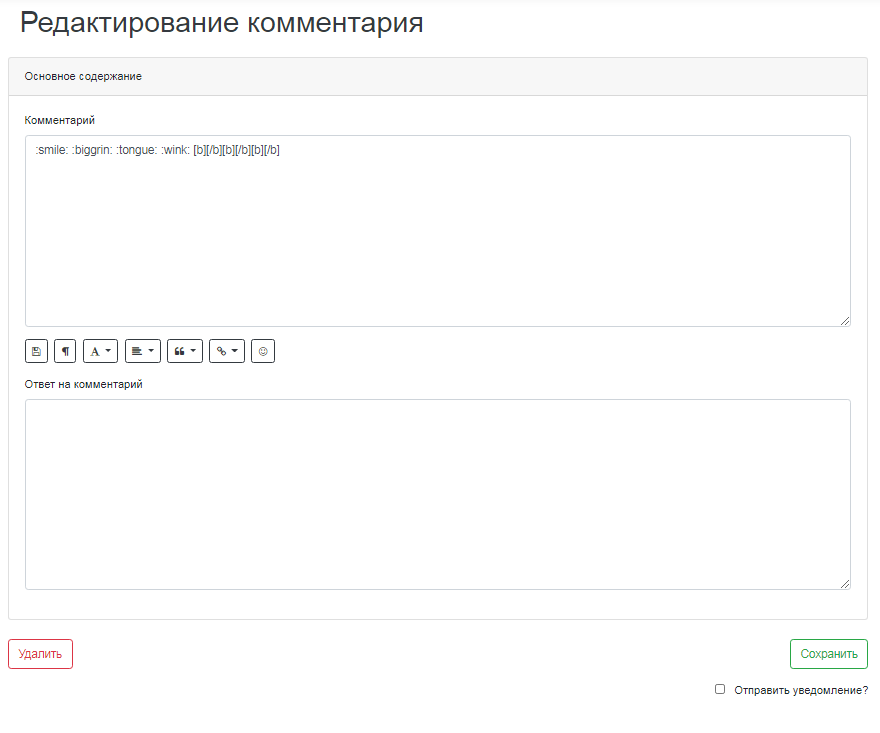

-   [Знакомство с системой]()
    -   [Основные сведения](about.html)
    -   [Вход в систему управления](enter.html)
    -   [Основные компоненты управления](components.html)
-   [Установка системы]()
    -   [Требования к хостингу](hosting.html)
    -   [Инсталляция](installation.html)
-   [Возможности NGCMS]()
    -   [Управление контентом]()
        -   [Новости](news.html)
        -   [Категории](catigories.html)
        -   [Статические страницы](static.html)
    -   [Настройки пользователей]()
        -   [Управление пользователями](users.html)
        -   [Блокировка IP-адресов](ipban.html)
    -   [Системные настройки]()
        -   [Настройки системы](config.html)
        -   [Управление базой данных](dbo.html)
        -   [Управление форматом ссылок](urls.html)
    -   [Дополнительные настройки]()
        -   [Управление плагинами](plugins.html)
        -   [Управление изображениями](images.html)
        -   [Управление файлами](files.html)
        -   [Управление шаблонами](templates.html)

Работа с новостями
==================

Данный компонент позволяет организовать и вести ленту новостей по типу онлайн-СМИ.
 Множество настроек визуализации и листинга, возможность подключить комментарии пользователей и систему оценок материалов пользователями.
 Применяется как на новостных проектах, так и на корпоративных, например, для освещения событий на рынке. Поддержка тегов (меток).
 Компонент предусматривает возможность поиска по новостям и их сортировку по различным критериям. (рис 3.1).

рис 3.1

Для удобства были созданы инструменты массового управления новостями. (рис 3.2).

рис 3.2

Добавление новости
==================

Для добавления новости, нажмите на ссылку "Добавить" в верхней информационной панели (рис 3.3).

рис 3.3

После этого вы будете перенаплавлены на страницу с формой, которую вам потребуется заполнить.

**Внимание:** в новости поля Заголовок и Текст новости являются обязательными для заполнения!.

**Заголовок** - указывается название новой страницы. Данные заголовка являются содержимым тега Title, которое показывается в заголовке окна браузера.
 **Текст** - собственно, сам текст новости.
 **Альт. имя** - здесь необходимо указать ссылку на данную страницу. **Внимание:** ссылка должна указываться на латинице и не содержать спецсимволов и пробелов.
 **Описание** - используется при создании краткого описания страницы, используется поисковыми системами для индексации.
 **Ключевые слова** - ключевые слова для метатега keyword.

**Настройки**

-   Опубликовать - в случае выбора данного флага, данная новость будет отображаться на сайте.
-   Отобразить на главной - в случае выбора данного флага, данная новость не будет отображаться на главной странице сайта.
-   Прикрепить - в случае выбора данного флага, данная новость будет отображаться первой на старнице.
-   Добавить в закладки - в случае выбора данного флага, данная новость будет добавлена в закладки (используется плагин favorites).
-   Разрешить использовать HTML теги - в случае выбора данного флага, в теле страницы, помимо bb кодов можно будет использовать html теги.
-   Отключить автоформатирование - в случае выбора данного флага, будет отключено автоформатирование текста, перенос строк и прочее.
-   Комментарии - используется при работе с плагином comments, возможно 3 варианта:
    запретить - комментарии будут запрещены
    разрешить - комментарии будут разрешены
    по умолчанию - флаг разрешения/запрета комментариев будет браться из настроек главной категории новости.

**Выбор категории**
 При добавлении новости можно выбрать одну или несколько категорий. При просмотре, новость будет отображаться в каждой из них. (рис 3.4).

рис 3.4

**Выбор времени публикации и работа со сторонними плагинами**
 При выборе вкладки "Дополнительно" отображается страница, с настройками даты и времени публикации. Также на этой странице расположены настройки сторонних плагинов, таких как tags, xfields и других.

рис 3.5

BB-коды, доступные в движке
===========================

-   **[b]** ... **[/b]** - выделить текст жирным шрифтом (аналог HTML тега \<b\> ... \</b\>)
-   **[u]** ... **[/u]** - выделить текст подчеркиванием (аналог HTML тега \<u\> ... \</u\>)
-   **[i]** ... **[/i]** - выделить текст курсивом (аналог HTML тега \<i\> ... \</i\>)
-   **[s]** ... **[/s]** - зачеркнуть текст (аналог HTML тега \<s\> ... \</s\>)
-   **[p]** ... **[/p]** - выделить абзац (аналог HTML тега \<p\> ... \</p\>)
-   **[ul]** ... **[/ul]** - тег форматирования (аналог HTML тега \<ul\> ... \</ul\>)
-   **[ol]** ... **[/ol]** - тег форматирования (аналог HTML тега \<ol\> ... \</ol\>)
-   **[li]** ... **[/li]** - тег форматирования (аналог HTML тега \<li\> ... \</li\>)
-   **[left]** ... **[/left]** - отцентровать текст по левому краю (аналог HTML тега \
 ... \</p\>)
-   **[right]** ... **[/right]** - отцентровать текст по центру (аналог HTML тега \
 ... \</p\>)
-   **[center]** ... **[/center]** - отцентровать текст по правому краю (аналог HTML тега \
 ... \</p\>)
-   **[code]** ... **[/code]** - выделить программный код (аналог HTML тега \<code\> ... \</code\>)
-   **[quote]** ... **[/quote]** - выделить цитату
-   **[quote=ИМЯ]** ... **[/quote]** - выделить цитату указав в качестве автора цитаты - **ИМЯ**
-   **[acronym]** ... **[/acronym]** - выделить акроним (аналог HTML кода \<acronym\>...\</acronym\>
-   **[acronym=ОПИСАНИЕ]** ... **[/acronym]** - выделить акроним с описанием(аналог HTML кода \<acronym title="**ОПИСАНИЕ**"\>...\</acronym\>
-   **[email]** **АДРЕС** **[/email]** - добавить ссылку на e-mail адрес **АДРЕС**
-   **[email=АДРЕС]** **ОПИСАНИЕ** **[/email]** - добавить ссылку на e-mail адрес **АДРЕС** указав в качестве описание - **ОПИСАНИЕ**. При этом адрес может браться в двойные кавычки
-   **[img=ССЫЛКА ФЛАГИ]** **ОПИСАНИЕ** **[/img]** - добавить картинку расположеную по адресу **ССЫЛКА** с описанием **ОПИСАНИЕ** установив флаги **ФЛАГИ**
     Можно использовать следующие флаги (значение флагов можно брать в кавычки), при этом наличие флагов - не обязательно:
     **width** - ширина картинки
     **height** - высота картинки
     **border** - толщина рамки вокруг картинки
     **align** - расположение картинки, может быть: left, right, center
     **class** - к какому CSS классу должна принадлежать картинка
     Пример: [img=http://htmlbook.ru/images/title.gif width=50 height="60" border=0 align=left]описание картинки[/img]
-   **[img ФЛАГИ]ССЫЛКА[/img]** - по аналогии с предыдущим пунктом, но **описание** будет генерироваться автоматически, в него пропишется имя файла (без пути)
-   **[url=ССЫЛКА ФЛАГИ]** **ОПИСАНИЕ** **[/url]** - добавить ссылку на ресурс, расположеный по адресу **ССЫЛКА** с описанием **ОПИСАНИЕ** установив флаги **ФЛАГИ**
     Можно использовать следующие флаги (значение флагов можно брать в кавычки), при этом наличие флагов - не обязательно:
     **target** - имя окна или фрейма куда браузер загружает данные (обычно используется окно со служебным именем **\_blank** - открыть ссылку в новом окне)
     **class** - к какому CSS классу должна принадлежать картинка
     Пример: [url=http://htmlbook.ru/ target="\_blank"]HTMLBook - документация по HTML[/url]
-   **[url ФЛАГИ]ССЫЛКА[/url]** - по аналогии с предыдущим пунктом, но **описание** будет генерироваться автоматически, оно будет соответствовать ссылке

Добавление изображения/файла к новости
======================================

Для добавления изображения к новости требуется нажать на соответствующую иконку на панели bb тегов. (рис 3.6).

рис 3.6

Откроется всплывающее окно - загрузчик изображений. (рис 3.7). Подробнее о непосредственной загрузке изображений и файлов, можно прочитать в соответствующем разделе справки.

рис 3.7

Добавить файл к новости можно двумя различными способами.

-   Непосредственно
-   При помощи аттачментов

Редактирование новости
======================

Редактирование новости имеет все теже самые настройки и опции что и добавление, за исключением вкладки "Комментарии".
 В этой вкладке отображаются все комментарии, которые были добавлены к данной новости.
 Инструмент позволяет быстро удалить/отредактировать их, либо заблокировать IP комментатора. (рис 3.11).

рис 3.11

Также можно посмотреть подробные сведенья о каждой комментарии отдельно. (рис 3.12).

рис 3.12

© 2008-2012 Next Generation CMS
