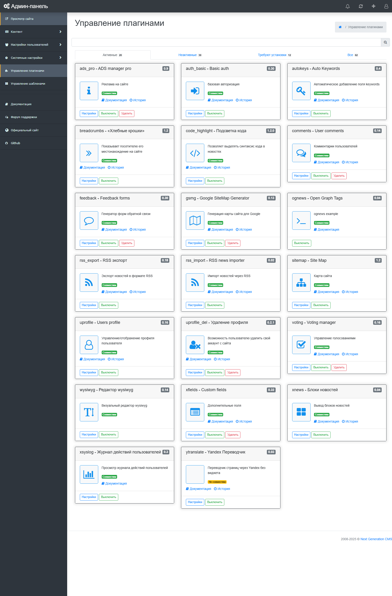

# Управление плагинами
Интерфейс управления плагинами состоит из 4 вкладок и 4 таблиц, в которых отображаются все плагины, которые могут быть установлены в Next Generation CMS. (рис 11.1).
**Плагины могут находиться в 3 состояниях:**
- Требуют установки (отмечены синим фоном).
- Требуют активации (отмечены белым фоном и серым цветом текста).
- Активированные (отмечены белым фоном и черным цветом текста).

рис 11.1
Все плагины, предназначенные для установки и активации, должны находиться в директории /engine/plugins/

## Формат плагина

Метаданные и документация каждого плагина хранятся в одном файле `engine/plugins/<pluginID>/plugin.md`. В начале файла находится front matter с полями `id`, `name`, `version`, `type` и другими параметрами плагина, после закрывающего `---` — обычная Markdown-документация.

Отдельные файлы `version`, `readme`, `README.txt`, `README.md`, `plugin.ini`, `info.ini` и `info.xml` для работы движка не нужны. Файлы `.ini` внутри `lang/` и конфигурационных каталогов плагинов сохраняются: это локализация и настройки, а не метаданные плагина.

В админ-панели документация открывается из того же `plugin.md` в окне управления плагинами.

Для переноса старых плагинов используется скрипт из корня проекта:

```powershell
powershell.exe -NoProfile -ExecutionPolicy Bypass -File .\migrate_plugins_to_markdown.ps1
```

Скрипт создаёт отсутствующие `plugin.md` и сохраняет старые файлы до завершения проверки.
© 2008-2025 Next Generation CMS
